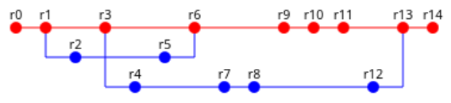

# SEMT Assigment: VCS

## Goal

Simulate a repository usage.


## Run

```bash
bash ci/run.sh git
bash ci/run.sh svn
```

## Project Structure

```bash
VSC_NAME="git" # or "svn"
tree ci/$VSC_NAME        # scripts for simulation
tree doc/$VSC_NAME       # some docs for youself
ls history             # commit history to simulate
tree playground/semt-assigment-vcs-$VSC_NAME-repository
```

## Code Style

```bash
VSC_NAME="git" # or "svn"
REPO_NAME="semt-assigment-vcs-$VSC_NAME-repository"
SCRIPT_NAME="example" # clean or init or main or ...
SCRIPT_MESSAGE_PREFIX="[$VSC_NAME:$SCRIPT_NAME]"
SCRIPT_MESSAGE="$SCRIPT_MESSAGE_PREFIX example message"
```

## Contribute

```bash
VSC_NAME="git" # or "svn"
git checkout trunk
git pull
git checkout -b $VSC_NAME-descriptive-name
# ...
git add -A
git commit -m "[$VSC_NAME] changes description"
git push
# * create a pull request into trunk *
```

## Authors

- [Artem @Ovoshchko Shinakov](https://github.com/Ovoshchko)
- [Victor @vityaman Smirnov](https://github.com/vityaman)
